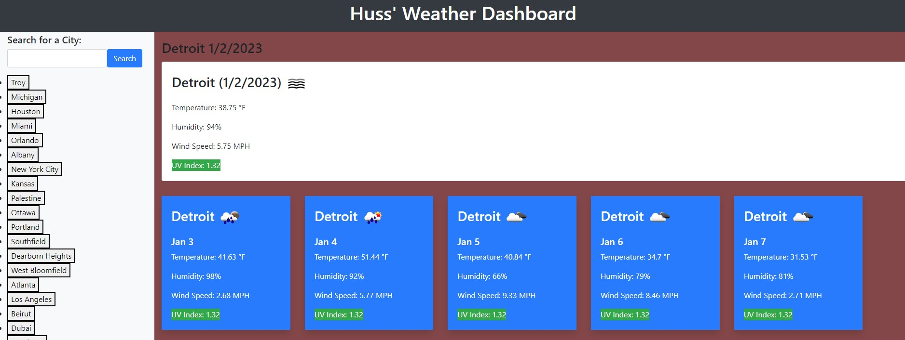

# Huss'-Weather-Dashboard

For this weeks assignment I created a weather dashboard for someone to search for the weather in a specific city. When the specific city is search, it will provide the current weather in addition to the 5 day forcast. 

## Steps Taken:
* Signed up for the OpenWeather API to obtain real time weather data and infromation about the weather in a specific city that is searched. 
* Used Bootstrap CSS for simple design and styling of the website
* Used JQuery JS for the interactive website components. 

Screenshot:

 

Link:  https://hussrizk56.github.io/Huss-s-Weather-Dashboard/

